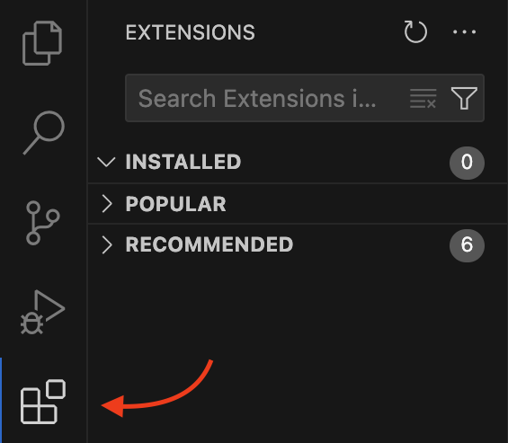
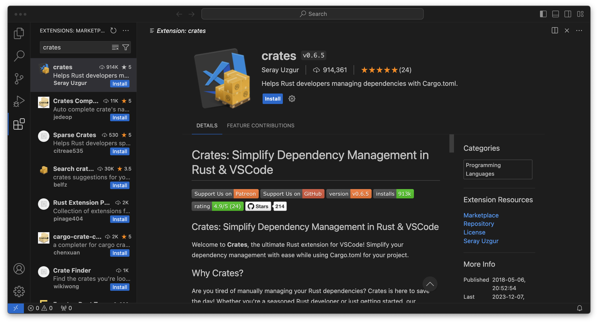

Why or Why Not, Installation and Hello World
============================================

1. [Why should you consider Rust](#why-should-you-consider-rust)
2. [Why not Rust](#why-not-rust)
3. [How to install Rust](#how-to-install-rust)
    1. [Mac and Linux](#mac-and-linux)
    2. [Windows](#windows)
4. [The Development Environment](#the-development-environment)
5. [Hello World](#hello-world)


Why should you consider Rust
----------------------------

I could tell you that its a "blazingly fast" language, that holds your hand and helps reduce bugs ,that its first party
tooling is second to none, that it has a mature ecosystem and an amazing community... but you're going to learn all
about that during this course. There is, in my mind, a singular reason everyone should learn Rust:

**Because its fun**

Seriously, Rust is my happy place. Sure it has its frustrations like any language, but when I work with Rust I _feel_
smart, I have less horrible surprises, and I have a lot of confidence that my code will "just work", that I won't need
to come back to fix bugs and if I do, I will be able to quickly understand old code, write new tests and fix any
problems.

But, I'm not alone, since its 1.0 release Rust has been Stack Overflows "most loved" (now "most admired") language eight
years in a row. This isn't derived from people like me just saying "its great" but is, of those who used the language
his year, what percentage still want to use it next year.

Why not Rust
------------

As much as I love Rust, there is a reason it may not be the language for you... and it's a _big_ one.

If you are specifically looking to learn a language to get a job (and you're not interested in Blockchain) Rust is not
going to be a good language... for now. The irony of "professional Rust" is that Rust engineers think there are no Rust
employers, and Rust employers think there are no Rust engineers _because_ very few of us are interested in Blockchain
technologies.

That said, things have been slowly changing. More businesses are picking it up due to its low cost to write, run and
maintain. The main cost to adopting Rust remains the cost of training people, but there are more and more of us out
there and perhaps 2024 will finally be the tipping point. 

Nonetheless, right now, if you're looking for a job,
[better languages to learn](https://survey.stackoverflow.co/2023/#most-popular-technologies-language-prof) would be
[TypeScript](https://www.typescriptlang.org) or [Python](https://www.python.org).

How to install Rust
-------------------

### Mac and Linux

Go to [https://rustup.rs](https://rustup.rs), copy the command displayed there into your terminal.


You will be given the option for customizing the installation, but we don't need to do that for now

```sh
$ curl --proto '=https' --tlsv1.2 -sSf https://sh.rustup.rs | sh

# [other information about the install appears here]

Current installation options:


   default host triple: x86_64-apple-darwin
     default toolchain: stable (default)
               profile: default
  modify PATH variable: yes

1) Proceed with installation (default)
2) Customize installation
3) Cancel installation
>
```

Choose 1 and wait for installation to complete. To immediately use rusts tools now, you will need to run the command it
tells you to run at the end of the installer, however, you should only need to do this once as the installer makes the
changes necessary for new terminal sessions to pick up on the changes.

```shell
$ source "$HOME/.cargo/env"
```

Now you can check whether everything has installed properly by running `cargo version` and you should see something
like this:

```sh
$ cargo version
cargo 1.75.0 (1d8b05cdd 2023-11-20)
```

Cargo is the main tool we'll use to build and work with Rust, you will need at least version `1.75` for this tutorial.

### Windows

Running Rust on Windows is a bit more challenging, but you've got this, I believe in you.

All the important differences for Windows are explain on [rustup.rs](https://rustup.rs), however, I personally
struggled a bit with this, so I'm laying it out here in my own words.

#### Windows Build Tools

The first thing we're going to need are some Microsoft build tools. 

Head to [https://visualstudio.microsoft.com/downloads/](https://visualstudio.microsoft.com/downloads/) and download the community tool.

The installer is the gateway to a huge number of tools and software, but we only need two things.

Click through to the Individual Components tab, and search for the following: `C++ x64/x86 build tools`

Select the latest version.

Next search for: `Windows 11 SDK`

Again, select the latest version.

Finally, choose your language and install.

#### Rustup

Once the Windows build tools are installed, head back to [rustup.rs](https://rustup.rs) and download `rustup-init.exe`.
Running this will install the tools we need.

Choose the default install options.

Once complete, we can check that things have been installed correctly by opening either `cmd` or `powershell` or your
terminal of choice, and run `cargo version`.

#### GCC (optional, but recommended)

Wait, rustup doesn't mention this!

I know, and you don't _necessarily_ need to do this. However, Rust is a language that can interop with other languages.
In particular, Rust works really well with existing C and C++ libraries. You might find yourself running 

The Development Environment
---------------------------

A software developers environment is something very specific to them. Some people love vim and neovim, others like Nova,
I'm personally a big fan of Rust Rover. If you've already found the tools for you, there's no wrong answer here, use
whatever makes you happy.

If you're new to software engineering though, and not looking to fork out potentially hundreds of dollars on tooling,
I recommend Visual Studio Code. It's free, is perhaps the most widely used and supported editor today, and can be
greatly extended through plugins.

It's the editor I'll be using for YouTube as I believe it will be the most familiar to people.

To get started head over to [https://code.visualstudio.com/](https://code.visualstudio.com/) and download the right
version for your device.

After installing it, we will need some plugins to work with Rust. To get to extensions, press the extensions button in
Side Bar (by default its on the left).



### rust-analyzer

Rust Analyzer will provide the bulk of languge support that we'll need. It'll give us auto complete, syntax highlighting
and symbol editing that will just make our lives a ton easier. Search for `rust-analyzer` in the search bar at the top
of the extensions tab and click install.


### CodeLLDB

As we learn any new language, one of the most important things for us to be able to do is see what's actually happening.
CodeLLDB allows us to pause a program while its running and see what its doing. This lets us check that a program is
doing the thing we think its doing.


### Even Better TOML

The Rust ecosystem makes heavy use of the TOML file format. We'll talk about this more much later on but now is a good
time to pick up this extension.


### crates

Rust developers share code through a mechanism called Crates. This extension will help us keep any crates we depend on
up to date. We won't be using crates for a while, but it's good to grab now. 



Hello World
-----------