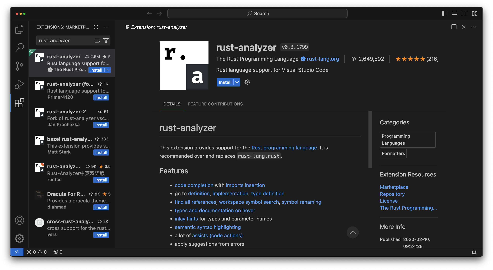

The Development Environment
===========================

A software developers environment is something very specific to them. Some people love vim and neovim, others like Nova,
I'm personally a big fan of IntelliJ. If you've already found the tools for you, there's no wrong answer here, use
whatever makes you happy.

If you're new to software engineering though, and not looking to fork out potentially hundreds of dollars on tooling,
I recommend Visual Studio Code. It's free, is perhaps the most widely used and supported editor today, and can be
greatly extended through plugins.

It's the editor I'll be using throughout this series as I believe it will be the most familiar to people.

To get started head over to [https://code.visualstudio.com/](https://code.visualstudio.com/) and download the right
version for your device.

After installing it, we will need some plugins to work with Rust. To get to extensions, open VSCode and press the
extensions button in the sidebar (by default the sidebar is on the left).

rust-analyzer
-------------

Rust Analyzer will provide the bulk of language support that we'll need. It'll give us auto complete, syntax
highlighting and symbol editing that will just make our lives a lot easier. Search for `rust-analyzer` in the search
bar at the top of the extensions tab and click install.

CodeLLDB
--------

As we learn any new language, one of the most important things for us to be able to do is see what's actually happening.
CodeLLDB allows us to pause a program while its running and see what its doing. This lets us check that a program is
doing what we think its doing.

Even Better TOML
----------------

The Rust ecosystem makes heavy use of the TOML file format. We'll talk about this more much later on but now is a good
time to pick up this extension.

crates
------

Rust developers share code through a mechanism called Crates. This extension will help us keep any crates we depend on
up to date. We won't be using crates for a while, but it's good to grab now. 

