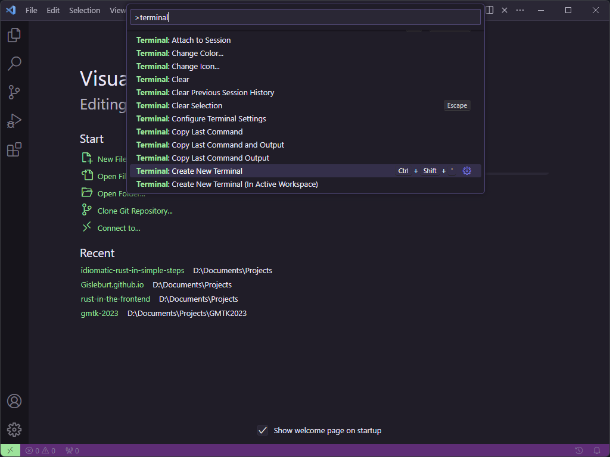
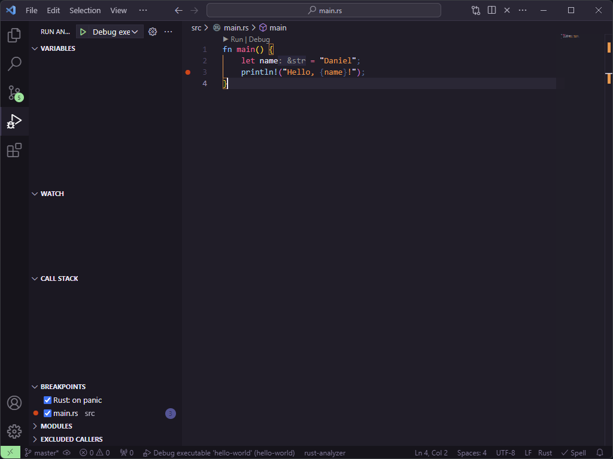

Hello World
===========

Now that we're finally set up, lets create our first program. As is tradition, our first program is simply going to
print the words `Hello, world!`.

1. [Creating a new Rust project](#creating-a-new-rust-project) 
2. [Anatomy of Hello World](#anatomy-of-hello-world)
3. [Running and Debugging Rust](#running-and-debugging-rust)

Creating a new Rust project
---------------------------

Open Visual Studio Code and open the terminal.

**Pro Tip:** If you're new to Visual Studio Code and you want the editor to do something (say, for example, open a
terminal), hold `Ctrl` + `Shift` and press `P` (or `Cmd` + `Shift` and press `P` on Mac). You can then type the thing
you want to do and it should show up in the list. Sometimes, like with Terminal, you might get a lot of results and
the one you want might need a little scroll. Normally for a Terminal you want to use it internally, so you'd scroll to
`Terminal: Create New Terminal`



Navigate to an appropriate location for your projects such as your home directory or my documents, depending on your
system.

Run `cargo new hello-world`

Cargo is the program we'll use to run our rust programs as well as many of the rust tools that will help us along the
way.

Now in Visual Studio Code, go to File -> Open Folder and navigate to the hello-world folder we just created.

You can see that cargo has created some files for us. We're going to talk about the cargo files later but for now,
head into the `src`` directory and open main.rs

You can see the file has already been created with the following code

```rust
fn main() {
    println!("Hello, world!");
}
```

Before we dive into this further, lets run the program.

Open the terminal again, as we did before. This time use `cargo run` to run our program, you should see something like
the following:

```sh
$ cargo run
   Compiling hello-world v0.1.0 (D:\Documents\hello-world)
    Finished dev [unoptimized + debuginfo] target(s) in 0.33s
     Running `target\debug\hello-world.exe`
Hello, world!
```

Well, that was easy 😅

You'll find the Rust community has put a lot of effort into making Rust as easy to use as possible to learn and use.

Anatomy of Hello World
----------------------

Lets talk about hello world.

The first line `fn main()` describes a function (fn) called main. Functions are a useful way to group up a bit of code
to be called elsewhere. We'll talk more about the power of functions and when to use them in a future chapter. For now
all we need to know is that the main function is called when the program starts, so any code we put in here will run.

At the moment, the only line of code is `println!("Hello, world!");`. A lot of engineers might assume this is how we
call functions in Rust, and that `println` is the function name. However, the exclamation mark actually tells us this
is a macro. Macro's are very powerful and can do much more than functions, however they are an advanced topic and we
won't be creating our own until much later. We will be using pre-written macros a fair bit though.

`println!` will write what its given to the console (stdout on *nix systems).

Running and Debugging Rust
--------------------------

Before we end this section, I want to quickly set uyp one of the most powerful tools we have thats going to help us
learn incredibly quicly.

First lets make a quick change to our program, by adding a variable with our name, and then saying hello to ourselves
instead of the whole world

```rust
fn main() {
    let name = "Daniel";
    println!("Hello, {name}!");
}
```

> Fun fact, Rust uses utf-8 strings when written like this, so don't worry if your name can not be properly represented in
> American English characters. For example, I might naively write my cats name like this:
>
> ```rust
> let name = "ユキ";
> ```
>
> However, this won't actually output correctly unless your system is set up to display it (thanks Windows).

Hover the mouse over the `3` denoting line 3 (where the `println!` should be) you should see a little red dot  appear.
Click this dot to set a break point. When debugging code, the debugger will pause at break points allowing us to see
whats actually happening.



To debug our code press F5... and it will immediately show you an error. Don't panic! This is where CodeLLDB is going
to do some magic for us. The error is because we didn't set a default run configuration, click OK and Visual Studio Code
will ask if you want to generate one. Click "yes", then press F5 again, and the program will start and then pause when
it hits line 3.

If you mouse over `name` on either line 2 or line 3, you'll see its value. Being able to see whats happening in a
running program is a programming super power.


To let the program continue, hit F5 one more time.
