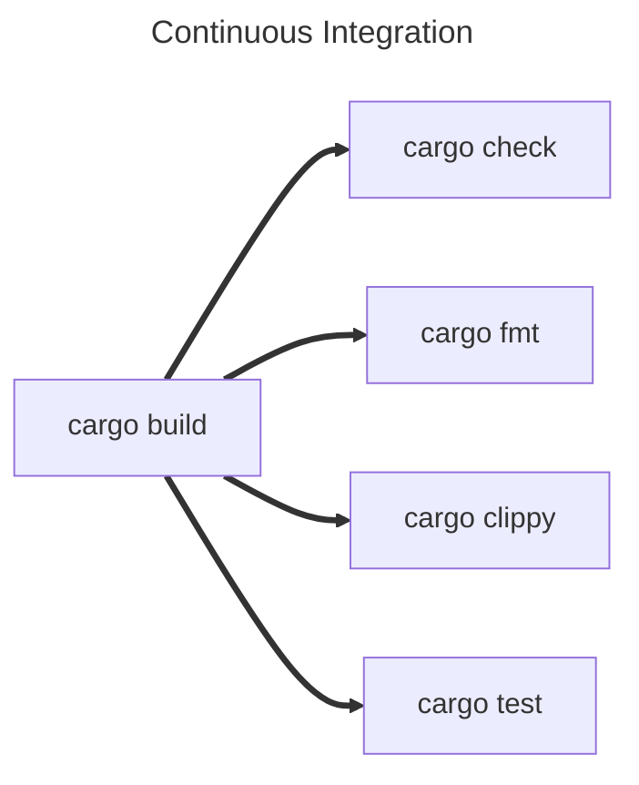

Clippy and Fmt
==============

The Rust ecosystem has a wealth of tools that support us when writing Rust but two of the most important ship with the
default tool suite.

- `cargo check` - we've used cargo a little bit to initialise, build and test our code, but it can provide even more
  utility to us than just that!
- `rustfmt` - Pronounced Rust Format, helps us keep our code styles consistent, so that its easy to share your code or
  read and learn from someone else's.
- `clippy` - Named after the old Microsoft Office tool, helps spot common mistakes, antipatterns, and even make
  suggestions on things like performance, scalability or readability improvements.

rustfmt
-------

`rustfmt` is a formatting tool for Rust. Programming language formatting tools allow you to configure how you want your
code to look. For example:

- Do you like opening curly brakets on the end of a line, like this:
    ```rust
    fn example() {
    # }
    ```
    or on a new line like this:
    ```rust
    fn example()
    {
    # }
    ```
- Do you indent with four spaces or two?
- Do you use a trailing comma, if a comma-seperated list is split onto multiple lines>
- How many empty lines are allowed between lines of code in a function?
- etc...

Maintaining a consistent style improves the legibility of code, making it faster for engineers to read and understand
what's happening. This is true, even if you only write code for yourself, using familiar patterns reduces the cognitive
load to parse what you're looking at. When working together as a group, it's important to come to an agreement as to
how you will style your code together, but luckily a Formatter will reduce the burden of having to maintain the style
once you've picked what to use.

Different languages have different "styles" that they follow. Some older languages may have multiple well established
styles to choose from. Luckily there's an official [Rust Style Guide](https://doc.rust-lang.org/nightly/style-guide/) 
that gives us a compelling reason in the community to all write code the same way, and Rust comes with its own formatter
called "Rust Format" that will automatically maintain the style for you!

You can call Rust Format manually using `cargo fmt` and it will automatically reformat your entire project, however its
definitely best if you can set your IDE to automatically run it any time you save a file. This will save you any big
unexpected changes.

If you just want it to tell you if anything is incorrectly formatted, you can use `cargo fmt --check`. We'll come back
to this later!

Finally, it might be that you and your team find some aspect of the official Rust Style Guide particularly egregious,
that's fine! Rust Format allows you to configure how it will format your code through `rustfmt.toml`. You can find
a complete guide to what you can control, and how, here: https://rust-lang.github.io/rustfmt/

clippy
------

Explainer
Basics
Configuring it

Cargo Check
-----------

Cargo can be used to perform some other cursory Check

Continuous Integration
----------------------

Continuous Integration is a technique that we use to maintain high quality, robust, and "correct" code in our code base.

Source code management systems like Git, Mercurial, Subversion (SVN), etc, are out of scope for this book, however, if
you haven't already, you should learn to use one of these as quickly as possible. I can't tell you which to use, it
depends on what kind of application you're building. Git is very common, but is better for things that are being
primarily built from text based resources, like websites, or desktop application. If you're making games or something
that uses a lot of images or other non-text based assets though you might want to use SVN, Plastic or Perforce.

Whatever you choose, you can use continuous integration to make sure that every time you make changes, those changes
make your project better, and minimise the risk of them making things worse.

How you achieve this will vary depending on not only what SCM you use, but potentially who hosts it. GitLab CI is
very different from GitHub Actions. The main idea however is to run a set of instructions before allowing changes to
be integrated (or merged) into the main project.

Typically for Rust projects, you will want to run at least the following four things:

???

`cargo check` will do a light, cursory check for any errors that will completely stop the application working.

`cargo fmt --check` will run cargo fmt without making any changes to your code. Instead, it will simply error if it 
finds anything that that doesn't fit the formatting rules.

`cargo clippy` can be run as normal and will check for any issues or improvements that should be addressed before
allowing the code to be integrated.

`cargo test` will run all tests and doc tests.

Where possible, these should be run in parallel, as none of them are dependent on each other, and you don't want to
have to fix one, wait for the next to fail, fix that but potentially break the first one.

However, all four will require you run `cargo build`, and ideally you don't want to do this four separate times. The
best way to do this is to do it once and cache the results for the next four tasks. Again, how you do this will depend

<style>
  .mermaid {
    text-align: center;
  }
  .mermaid svg {
    background-color: white;
  }
</style>



