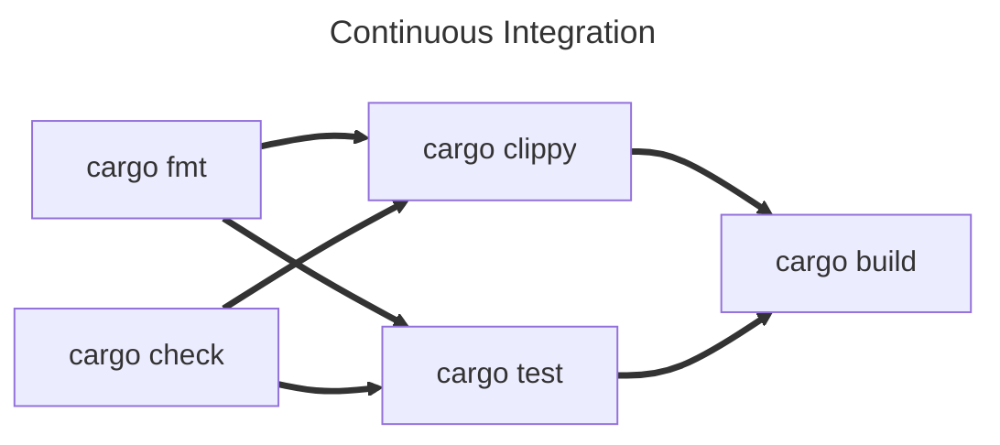
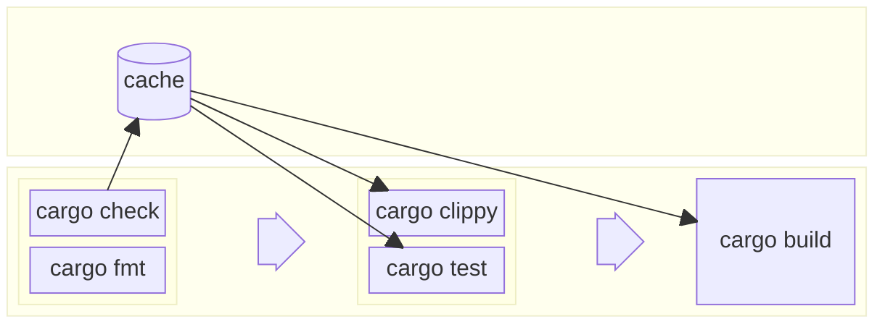

Clippy and Fmt
==============

The Rust ecosystem has a wealth of tools that support us when writing Rust but two of the most important ship with the
default tool suite.

- `cargo check` - we've used cargo a little bit to initialise, build and test our code, but it can provide even more
  utility to us than just that!
- `rustfmt` - Pronounced Rust Format, helps us keep our code styles consistent, so that its easy to share your code or
  read and learn from someone else's.
- `clippy` - Named after the old Microsoft Office tool, helps spot common mistakes, antipatterns, and even make
  suggestions on things like performance, scalability or readability improvements.

rustfmt
-------

`rustfmt` is a formatting tool for Rust. Programming language formatting tools allow you to configure how you want your
code to look. For example:

- Do you like opening curly brakets on the end of a line, like this:
    ```rust
    fn example() {
        // ...
    }
    ```
    or on a new line like this:
    ```rust
    fn example()
    {
        // ...
    }
    ```
- Do you indent with four spaces:
  ```rust
  fn hello() {
      println!("Hello");  
  }
  ```
  or two:
  ```rust
  fn hello() {
    println!("Hello");  
  }
  ```
- Does the last item in a list across multiple lines have a trailing comma:
  ```rust
  let list = [
      "one",
      "two",
  ]
  ```
  or not:
  ```rust
  let list = [
      "one",
      "two"
  ]
  ```
- How many empty lines are allowed between lines of code in a function?
- etc...

Maintaining a consistent style improves the legibility of code, making it faster for engineers to read and understand
what's happening. This is true, even if you only write code for yourself, using familiar patterns reduces the cognitive
load to parse what you're looking at. When working together as a group, it's important to come to an agreement as to
how you will style your code together, but luckily a Formatter will reduce the burden of having to maintain the style
once you've picked what to use.

Different languages have different "styles" that they follow. Some older languages may have multiple well established
styles to choose from. Luckily there's an official [Rust Style Guide](https://doc.rust-lang.org/nightly/style-guide/) 
that gives us a compelling reason in the community to all write code the same way, and Rust comes with its own formatter
called "Rust Format" that will automatically maintain the style for you!

You can call Rust Format manually using `cargo fmt` and it will automatically reformat your entire project, however its
definitely best if you can set your IDE to automatically run it any time you save a file. This will save you any big
unexpected changes.

If you just want it to tell you if anything is incorrectly formatted, you can use `cargo fmt --check`. We'll come back
to this later!

Finally, it might be that you and your team find some aspect of the official Rust Style Guide particularly egregious,
that's fine! Rust Format allows you to configure how it will format your code through `rustfmt.toml`. You can find
a complete guide to what you can control, and how, here: https://rust-lang.github.io/rustfmt/

`rustfmt` should now come with the rust tool suite by default, but if for some reason you don't have it, you can install
it with `rustup component add rustfmt`

clippy
------

Clippy is Rust's linter, a tool that can not only make sure your code is correct (`rustc` technically already does
_that_ for you) but even offer suggestions on how to improve your code, and explain why an alternative might be better!

To run Clippy with the default configuration, simply type `cargo clippy`

This is an incredibly powerful tool, not just for making sure your code is the best it can be, but as an aid for
learning.

Antithetical to that, though still incredibly useful, Clippy can go right ahead and fix many of the common issues it 
might find, simply by passing the `--fix` flag (eg: `cargo clippy --fix`).

And, Clippy won't just check your code either, it can also spot common mistakes in your documentation (we love
documentation here if you couldn't tell 😅). For example, if in your doc comments you use underscores `_` or double 
colons `::` outside of backticks, Clippy will assume this is a mistake and let you know.

There's a lot of flexibility in how you can configure Clippy. Lints are broken up into groups for easy control, so we
typically might decide at the group level, what to include, and whether it should be considered a warning or completely
denied. For example, I tend to use the `pedantic` list of lints with a warning (these are usually allowed by clippy 
which means you don't get told if there is a potential issue). 

To do this you can either:
- run: `cargo clippy -- -W clippy::pedantic` or...
- in my entry file to my project (eg, `main.rs`, or `lib.rs`) I can add the line:
  ```rust
  #![warn(clippy::pedantic)]
  ```

The benefit of the latter is you can set a nice default for the project without you or anyone else needing to remember 
what options to pass to Clippy, while the former is useful if you want to override any other behaviour.

For a full list of lints, check the list here: https://rust-lang.github.io/rust-clippy/master/index.html#/Configuration

Clippy should now come with the rust tool suite by default, but if for some reason you don't have it, you can install
it with `rustup component add clippy`.

Cargo Check
-----------

There's one last tool I want to mention quickly, and it will initially seem quite underwhelming by comparison to the
others, but stick with me.

`cargo check` is a tool will... check your code and all its dependencies for errors. Groundbreaking, right?

Since we'd find out that our code has errors when we try to build it with `cargo build`, what's the use of 
`cargo check`? Well, `cargo check` essentially does the same job as `cargo build` but skips the final step of code
generation. This means it's faster, and importantly, cheaper to perform, meaning it can be used as a fast-fail.

The work it does isn't wasted either. Because it does in fact perform some of the compilation steps, the output of this
is cached on your machine so that other tools (such as `cargo build` and Clippy) can use that to skip earlier steps in
their own processes.

This might not seem very useful on your machine, but it comes in very handy with Continuous Integration.

Continuous Integration
----------------------

Continuous Integration is a technique that we use to maintain high quality, robust, and "correct" code in our code base.

Source code management systems like Git, Mercurial, Subversion (SVN), etc, are out of scope for this book, however, if
you haven't already, you should learn to use one of these as quickly as possible. I can't tell you which to use, it
depends on what kind of application you're building. Git is very common, but is better for things that are being
primarily built from text based resources, like websites, or desktop application. If you're making games or something
that uses a lot of images or other non-text based assets though you might want to use SVN, Plastic or Perforce.

Whatever you choose, you can use continuous integration to make sure that every time you make changes, those changes
make your project better, and minimise the risk of them making things worse.

How you achieve this will vary depending on not only what SCM you use, but potentially who hosts it. GitLab CI is
very different from GitHub Actions. The main idea however is to run a set of instructions before allowing changes to
be integrated (or merged) into the main project.

Typically for Rust projects, you will want to run at least the following four things:

???

`cargo check` will do a light, cursory check for any errors that will completely stop the application working.

`cargo fmt --check` will run cargo fmt without making any changes to your code. Instead, it will simply error if it 
finds anything that that doesn't fit the formatting rules.

`cargo clippy` can be run as normal and will check for any issues or improvements that should be addressed before
allowing the code to be integrated.

`cargo test` will run all tests and doc tests.

Where possible, these should be run in parallel, as none of them are dependent on each other, and you don't want to
have to fix one, wait for the next to fail, fix that but potentially break the first one.

However, all four will require you run `cargo build`, and ideally you don't want to do this four separate times. The
best way to do this is to do it once and cache the results for the next four tasks. Again, how you do this will depend

<style>
  .mermaid {
    text-align: center;
  }
  .mermaid svg {
    background-color: white;
  }
</style>





