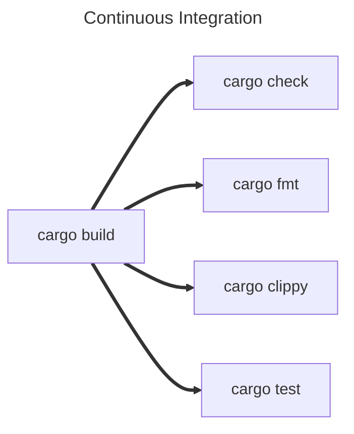

Clippy and Fmt
==============

The Rust ecosystem has a wealth of tools that support us when writing Rust but two of the most important ship with the
default tool suite.

`rustfmt` (pronounced Rust Format) helps us keep our code styles consistent, so that its easy to share your code or read
and learn from someone elses.

`clippy` (named after the old Microsoft Office tool) helps spot common mistakes, antipatterns, and even make suggestions
on things like performance, scalability or readability improvements.

rustfmt
-------

Basics
Configuring it

clippy
------

Continuous Integration
----------------------

Continuous Integration is a technique that we use to maintain high quality, robust, and "correct" code in our code base.

Source code management systems like Git, Mercurial, Subversion (SVN), etc, are out of scope for this book, however, if
you haven't already, you should learn to use one of these as quickly as possible. I can't tell you which to use, it
depends on what kind of application you're building. Git is very common, but is better for things that are being
primarily built from text based resources, like websites, or desktop application. If you're making games or something
that uses a lot of images or other non-text based assets though you might want to use SVN, Plastic or Perforce.

Whatever you choose, you can use continuous integration to make sure that every time you make changes, those changes
make your project better, and minimise the risk of them making things worse.

How you achieve this will vary depending on not only what SCM you use, but potentially who hosts it. GitLab CI is
very different from GitHub Actions. The main idea however is to run a set of instructions before allowing changes to
be integrated (or merged) into the main project.

Typically for Rust projects, you will want to run at least the following four things:

???

`cargo check` will do a light, cursory check for any errors that will completely stop the application working.

`cargo fmt --check` will run cargo fmt without making any changes to your code. Instead, it will simply error if it 
finds anything that that doesn't fit the formatting rules.

`cargo clippy` can be run as normal and will check for any issues or improvements that should be addressed before
allowing the code to be integrated.

`cargo test` will run all tests and doc tests.

Where possible, these should be run in parallel, as none of them are dependent on each other, and you don't want to
have to fix one, wait for the next to fail, fix that but potentially break the first one.

However, all four will require you run `cargo build`, and ideally you don't want to do this four separate times. The
best way to do this is to do it once and cache the results for the next four tasks. Again, how you do this will depend

