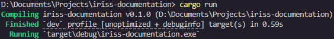
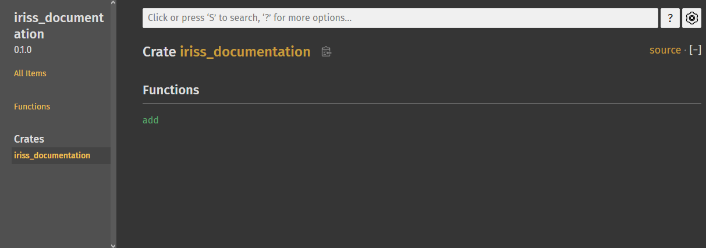
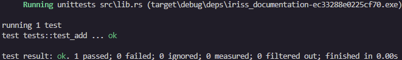
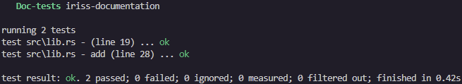

Documentation
=============

Documentation. Is. Awesome... in Rust.

Good documentation is awesome all the time but Rust provides some tools that make documenting your project a truly
magical experience. In Rust good documentation is low effort and high value.

Documentation is important. You'll hear a lot of things in Software like "the code should document itself" and "the
tests should document the code", and this is all true, but it's not a _substitute_ for documentation. Easy to understand
code is incredibly important when you work in a code base so that you can easily understand it and maintain it. And, as
we spoke about in the last chapter, tests are important to show our expectations of what the code will do when used.

But code and tests are not there primarily to teach someone how to use the code. They can do that, but its secondary,
meaning that someone consuming this for the purpose of learning how to use the code, is having to deal with information
they don't need.

As software engineers, a huge part of our role is communication, and good documentation conveys how to use our work as
quickly, and as painlessly as possible. Rust understands this and provides a full suite of tools that make producing
documentation, not just trivial, but also fun!

Libraries
---------

In order to show the value of documentation, we're going to create our first Rust library.

Up to now, we've been building binaries. Rust compiles `main.rs` into an executable, but our projects can link to and,
use functionality from, libraries. This is particularly helpful when sharing and reusing code. We'll be talking much
more about how we share code with each other when we cover the Rust ecosystem, but even as we're just learning the 
language, we can leverage the power of libraries for things like code reuse within the same project.

Let's try it out. First, lets make a normal program, remember you can do this with something like:
`cargo new iriss-documentation`

In `main.rs`, we'll make a single function and our main program will just check it works.

```rust
fn add(a: usize, b: usize) -> usize {
    a + b
}

fn main() {
    assert_eq!(add(40, 2), 42);
}
```

Next, lets migrate the add function to a library. Create a new file called `lib.rs`. In the same way that `main.rs` is
the entry to our binary, `lib.rs` is the entry point to our library. Our library acts like any other module and the
module is named the same thing as our project (though swap hyphens `-` for underscores `_`). Anything public in `lib.rs`
will be available to anyone using the library.

We'll move our add function to the `lib.rs` and make it public so that we can access it from `main.rs`:

```rust,noplayground
// lib.rs
pub fn add(a: usize, b: usize) -> usize {
    a + b
}
```

We can now use this function in our main function via the project module (eg, `iriss_documentation`).

```rust,noplayground
# // This is included for `mdbook test` which I'm using to check for obvious mistakes,
# // this _should_ be in lib.rs in your project and not in a module
# mod iriss_documentation {
#     pub fn add(a: usize, b: usize) -> usize {
#         a + b
#     }
# }
// main.rs
use iriss_documentation::add;

fn main() {
    assert_eq!(add(40, 2), 42, "We expect 40 + 2 = 42");
}
```

> ℹ️ Note: Although our project name  is `iriss-documentation` with a hyphen, the library name will be
> `iriss_documentation` with an underscore.

If we run our program right now, you can see that it still works but... we're not really taking advantage of the library
though, what's the difference between this and what we had before?

The main way you're likely to share code is through Rusts package management system called Crates. Were you to publish
this project right now (please don't though, _this_ project is obviously pretty useless 😅), then theoretically other
people could use your `add()` function. But, we aren't going to cover Crates at all in the language basics portion of
this book.

That doesn't mean this technique isn't useful though. To show how it can be useful, lets make another change to our
project.

Now that we've got our `lib.rs`, lets move `main.rs` to `bin/main.rs`. The program still runs if you use `cargo run` but
if you look closely there is a difference.

Before:



After:


In the last line, you'll see the name of the binary has changed from `iriss-documentation.exe` to `main.exe`. This is
because when the project was a single binary file, the executable was simply named after the project. By using the
`bin` directory, we're telling Rust we expect to produce multiple binaries from this project, so now it takes the name
from the file name instead of the project.

To fix this, rename `bin/main.rs` to `bin/iriss-documentation.rs` and cargo will go back to creating
`iriss-documentation.exe`. 

You can now create more binaries in this directory called different things and all of them will have access to the
library we've created! 

Feel free to try this out, but bear in mind that once you have more than one file in that directory, you will have to
tell cargo which binary you want it to focus on. For example: `cargo run --bin iriss-documentation`

rustdoc
-------

The Rust toolset includes a program called `rustdoc` which we can run through Cargo using `cargo doc`. It's builds and
combines the documentation, not only from your code, but from any libraries and crates you're using.

Let's jump in and try it out with our code, if you run `cargo doc --open` it will build the documentation and then open
it in your browser. As you can see, without us doing anything rustdoc has figured out about our add function.



You'll notice that it's only documented our library. This is because people consuming your code can't use code in the
binary.

If you click the `add` function, it'll take you to the documentation page. Rustdoc has already worked out the header
for the function, but that's all the information there is for now.


So how do we actually give the consumers of our library the information they need? Comments! ... kinda.

Doc Comments
------------

Comments are used to communicate information to anyone reading the source code, but are completely ignored by the
compiler. We usually talk about two styles of comments:
- Line comments: starting at `//` and ending at the end of the line
- Block comments: starting at `/*` and ending with `*/`

Many languages like Java, JavaScript, PHP, and more, also support a special type of comment called a Doc Comment. Like
comments, these are to convey information about nearby code, and are ignored by the compiler, however you can use
documentation tooling to read them and produce the documentation for you.

Rust takes this idea and turbocharges it... but we'll get to that.

For now, there are two subtypes of Doc Comments:
- Outer Doc Comments
- Inner Doc Comments

It's possible to create these comments as either line comments or block comments _however_, the convention[^rfc1574] is
to always use line comments, even if the comment spans many lines. The reason for this appears to be ambiguity in
terminating block comments, and the desire for consistency.

Outer Doc Comments are placed before the thing that's being documented and use `///` for each line of the comment, and
we'll use them for most things like modules, types and our `add()` function.

```rust,noplayground
/// Adds two numbers together.
pub fn add(a: usize, b: usize) -> usize {
    a + b
}
```

We can re-run `cargo doc` and refresh the page in our browser and our `add` function now has a little explanation.


That's neat, but we could have worked that out from the name. Rust documentation uses markdown, which means we can
use formatting and code snippets, as well as consecutive lines being treated as a single paragraph. Let's add some more
detail and explain how to use the function using the same technique we learned in the last chapter, assertions. 

Doing it this way may seem odd, but all will be explained in a moment.

```rust,noplayground
/// Adds two numbers together.
///
/// You can use this function to add two `usize` numbers together. It's a little bit pointless, obviously, we're only
/// doing this to demonstrate the benefits of good documentation.
///
/// ```
/// use iriss_documentation::add;
///
/// let a = 40;
/// let b = 2;
/// let c = add(a, b);
///
/// assert_eq!(c, 42, "We expect {a} + {b} = 42");
/// ```
pub fn add(a: usize, b: usize) -> usize {
    a + b
}
```

Rebuilding our documentation now gives us the code sample too, isn't that cute!


What's also cool, is that if we go back to the top level of our library where our `add` function was listed, you can
see that `add` now has a nice little summary, it's the first line of our documentation. This is worth bearing in mind
as you write your documentation. Try to keep this line terse but descriptive.


Before we move on, we should also provide some documentation for our library. We can't put Outer Doc Comments before the
library because the library _is_ the file. Instead, we use Inner Doc Comments, which are prefixed with `//!`. We do this
at the top of the file. Let's provide a little 

```rust,noplayground
//! This library does little more than provide us a way of playing with documentation
//!
//! We can use all kinds of markdown in Doc Comments, including:
//!
//! Various
//! =======
//!
//! Heading
//! -------
//!
//! ### Styles
//!
//! Horizontal lines
//!
//! ---
//!
//! And even code!
//!
//! ```
//! println!("Hello, world!");
//! ```

/// ...
pub fn add(a: usize, b: usize) -> usize { /* ... */ }
```

And all of this will render nicely into our documentation.


> ℹ️ Note: You can use Inner Doc Comments for all sorts of things, like modules that are in curly brackets. But, again,
> the convention[^rfc1574] is to only use Inner Doc Comments for files, whether thats your main library file, or module
> files (eg, `my_module/mod.rs`, or `./my_module.rs`).

Doc-Tests
---------

Some people say tests should be the documentation, but here we say the documentation should be the tests!

Well, ok, not _the_ test, you absolutely should still write your unit tests, etc. 😅

But without doing anything else to our project, try running `cargo test`.


There's a few things to notice here.

First, we seem to be getting three sets of tests. Second, we have two passing tests... but we didn't write any tests, 
did we?

The order of test suites, and individual tests you see may differ from the above, but you should have one test suite
for our library (`lib.rs`), one test suite for our binary (`iriss-documentation.rs`), and one for Doc-tests. The first
two have no tests, but Doc-tests have two tests.

What's happened here is that `cargo test` is treating any code samples as tests (unless we ask it not to).

Let's quickly add a test to `lib.rs` to look more closely at the difference.

```rust,noplayground
//! ...

/// ...
pub fn add(a: usize, b: usize) -> usize { /* ... */ }

#[cfg(test)]
mod tests {
    use super::*;

    #[test]
    fn test_add() {
        let a = 40;
        let b = 2;
        let c = add(a, b);

        assert_eq!(c, 42, "We expect {a} + {b} = 42");
    }
}

```

Now when we run again we get some interesting comparison.

Unit Tests:



Doc Tests:



In the unit test, the test name is the fully qualified path to the test function (`test::test_add`)

In the doc tests, it's the file, the name of the thing being documented (unless it _is_ the file) and the line of the
start of the code block.

This makes them slightly less useful _as_ tests. So why would we do it?

Well, the leading cause of bad documentation, and the reason why people so often don't bother writing it to start with
is that it needs to be maintained. One of the worst things we can do in documentation is tell someone they can achieve
an outcome in a particular way, then change the code so that particular way no longer works as expected.

Writing our documentation as test ensures that our documentation is correct, and keeping our documentation right next
to the thing being documented makes it trivial to update. Rust guarantees that if you said the code works in a 
particular way, so long as you also wrote an example with assertions, then the documentation is correct!

Sharing Documentation
---------------------

To paraphrase Dr Strangelove: Of course, the whole point of **documentation** is lost, if you keep it a secret!

How do we tell people about our documentation?

There's two ways documentation gets shared and neither of them require any work on your behalf.

We'll go into this a further in the ecosystem section of the book, however when you're ready to share your code, we
use cargo to "publish" the code to [crates.io](https://crates.io). When someone downloads your code from there, they
get the source code which includes your documentation. This means when they build their documentation, they can also
build your documentation.

The second way our documentation is shared is that when we publish to crates.io, our documentation is compiled and
uploaded to another service, [docs.rs](https://docs.rs). On this service you can find every version of API documentation
for every crate (library) ever published!

Summary
-------

So Rust documentation has some really compelling things going on:

1. Documentation tooling comes with the rust tool suite
2. Documentation is written with code, not separately from it
3. Code examples are run with tests, meaning it's very hard to produce documentation that's wrong

Because the prescribed method of writing documentation is so good, everyone ends up using the same tools and the same
conventions, which means Rust documentation will always feel somewhat familiar, significantly reducing the burden of
learning.

It's one of the many examples of how the Rust community feeds into itself, helping us all be better software engineers.

Homework
--------

In the last chapter, we asked you to do three things, one at a time, starting with the test and then writing the
implementation.

1. Create a function that will reverse the words in an English sentence.
2. If the string starts or ends with whitespace, it should be removed (trimmed) from the returned String.
3. If the string contains more than one sentence, the function should return an error (though for now, that error can
   be the unit type `()`).

> Please note an earlier version of this book had 4 requirements, the second one has been removed. See the 
> [homework section of this chapters video](https://www.youtube.com/watch?v=MLTy-UmLCnk?t=856) to see how it can be
> solved, and why I chose to remove it.

We want to start with the test, but we can't create the test without the function existing, so the easiest way to
proceed is to design the interface of the function and use the `todo!` macro so that we can integrate it into a test.
We know later we'll want to return an Error, so we've got a string slice input, and a Result output where the Ok variant
is a `String`.

```rust,noplayground
fn reverse_sentence(_input: &str) -> Result<String, ()> {
    todo!("Write the reverse_sentence function")
}
```

We then create our first test, but because our first requirement doesn't tell us too much, we'll keep it simple; all
lowercase, no punctuation.


```rust,noplayground
# fn reverse_sentence(_input: &str) -> Result<String, ()> {
#     todo!("Write the reverse_sentence function")
# }
# 
#[cfg(test)]
mod tests {
    use super::*;
    
    #[test]
    fn test_reverse_words() {
        let input = "this is my test input";
        let output = reverse_sentence(input);
        assert_eq!(output, Ok("input test my is this".to_string()));
    }
}
```

Now that we have a failing test, lets fix the code. I'm going to use our split_around_many function but if you used the
built-in split function instead, well done, bonus points to you! It's actually more efficient that way, and you can in
fact reduce the memory allocations down to just one.

I decided to stick with our existing functions for simplicity. We can split the string around spaces to get a vector of
words, then we can call reverse on the vector to get the words in the opposite order. Finally, we can join the vector of
strings with spaces to create our output string.

```rust,noplayground
fn reverse_sentence(input: &str) -> Result<String, ()> {
    let mut words: Vec<&str> = split_around_many(input, " ");
    words.reverse();
    Ok(words.join(" "))
}
# 
# #[cfg(test)]
# mod tests {
#     use super::*;
#     
#     #[test]
#     fn test_reverse_words() {
#         let input = "this is my test input";
#         let output = reverse_sentence(input);
#         assert_eq!(output, Ok("input test my is this".to_string()));
#     }
# }
```

Now the test passes.

Next lets look at trimming the string.

In the requirements I did say "any whitespace" so lets test with a space on one end and a tab on the other.

```rust,noplayground
# fn reverse_sentence(input: &str) -> Result<String, ()> {
#     let mut words: Vec<&str> = split_around_many(input, " ");
#     words.reverse();
#     Ok(words.join(" "))
# }
# 
#[cfg(test)]
mod tests {
    use super::*;

    // ...
#     #[test]
#     fn test_reverse_words() {
#         let input = "this is my test input";
#         let output = reverse_sentence(input);
#         assert_eq!(output, Ok("input test my is this".to_string()));
#     }

    #[test]
    fn test_reverse_words_trims_string() {
        let input = " this string has weird whitespace\t";
        let output = reverse_sentence(input);
        assert_eq!(output, Ok("whitespace weird has string this".to_string()));
    }
}
```

Again, this test won't pass when we run it, so lets implement the feature.

String slices have a [method called `.trim()`](https://doc.rust-lang.org/std/primitive.str.html#method.trim), which will
return a string slice that points to the characters inside the original string slice without surrounding whitespace. 
This is really cool because it means we didn't need to allocate any more memory. We can also shadow the `input` 
variable, so we only need to add one line to the function!

```rust,noplayground
fn reverse_sentence(input: &str) -> Result<String, ()> {
    let input = input.trim();
    let mut words: Vec<&str> = split_around_many(input, " ");
    words.reverse();
    Ok(words.join(" "))
}
# 
# #[cfg(test)]
# mod tests {
#     use super::*;
# 
#     #[test]
#     fn test_reverse_words() {
#         let input = "this is my test input";
#         let output = reverse_sentence(input);
#         assert_eq!(output, Ok("input test my is this".to_string()));
#     }
# 
#     #[test]
#     fn test_reverse_words_trims_string() {
#         let input = " this string has weird whitespace\t";
#         let output = reverse_sentence(input);
#         assert_eq!(output, Ok("whitespace weird has string this".to_string()));
#     }
# }
```

The final requirement is to return an error if there is more than one sentence. We haven't dealt with punctuation yet
so let's create an assertion that an ending dot is fine, and a second assertion that one in the middle of a sentence
causes an error. The first assertion should pass without any changes, but helps make sure we don't break this as we
implement feature.

```rust,noplayground
# fn reverse_sentence(input: &str) -> Result<String, ()> {
#     let input = input.trim();
#     let mut words: Vec<&str> = split_around_many(input, " ");
#     words.reverse();
#     Ok(words.join(" "))
# }
# 
#[cfg(test)]
mod tests {
    use super::*;

    // ...
#     #[test]
#     fn test_reverse_words() {
#         let input = "this is my test input";
#         let output = reverse_sentence(input);
#         assert_eq!(output, Ok("input test my is this".to_string()));
#     }
# 
#     #[test]
#     fn test_reverse_words_trims_string() {
#         let input = " this string has weird whitespace\t";
#         let output = reverse_sentence(input);
#         assert_eq!(output, Ok("whitespace weird has string this".to_string()));
#     }

    #[test]
    fn test_reverse_words_reject_multiple_sentances() {
        let input = "sentance one.";
        let output = reverse_sentence(input);
        assert_eq!(output, Ok("one. sentance".to_string()));

        let input = "sentance one. sentance two";
        let output = reverse_sentence(input);
        assert_eq!(output, Err(()));
    }
}
```

To implementing this feature, we can check the words iterator after the split, but before the reverse, for any full
stops that occur before the final word. To do this we'll iterate over the vector, taking all but the last element, and
if any word ends with a `.` we can assume it's a sentence break.

```rust,noplayground
fn reverse_sentence(input: &str) -> Result<String, ()> {
    let input = input.trim();
    let mut words: Vec<&str> = split_around_many(input, " ");
    
    if words
        .iter()
        .take(words.len() - 1)
        .any(|word| word.ends_with('.'))
    {
        return Err(());
    }
    
    words.reverse();
    Ok(words.join(" "))
}
# 
# #[cfg(test)]
# mod tests {
#     use super::*;
# 
#     #[test]
#     fn test_reverse_words() {
#         let input = "this is my test input";
#         let output = reverse_sentence(input);
#         assert_eq!(output, Ok("input test my is this".to_string()));
#     }
# 
#     #[test]
#     fn test_reverse_words_trims_string() {
#         let input = " this string has weird whitespace\t";
#         let output = reverse_sentence(input);
#         assert_eq!(output, Ok("whitespace weird has string this".to_string()));
#     }
# 
#     #[test]
#     fn test_reverse_words_reject_multiple_sentances() {
#         let input = "sentance one.";
#         let output = reverse_sentence(input);
#         assert_eq!(output, Ok("one. sentance".to_string()));
# 
#         let input = "sentance one. sentance two";
#         let output = reverse_sentence(input);
#         assert_eq!(output, Err(()));
#     }
# }
```

Were we doing this properly, of course we'd use proper errors... but proper errors are for another time 😉

This time for the homework, I'd like you to create a library that contains our three split functions from the last few 
chapters (I've rewritten them below, use the 👁️ icon to show hidden lines).

```rust,noplayground
pub fn split_at(input: &str, at: usize) -> (&str, &str) {
#     let up_to = std::cmp::min(at, input.len()); // Prevent out of bounds
#     (&input[..up_to], &input[up_to..])
}

pub fn split_around<'a>(input: &'a str, sub_string: &str) -> (&'a str, &'a str) {
#     if let Some(found_at) = input.find(sub_string) {
#       (&input[..found_at], &input[found_at + sub_string.len()..])
#     } else {
#       (&input[..], &input[input.len()..])
#     }
}

# fn split_around_many_recurse<'a>(input: &'a str, sub_string: &str, collection: &mut Vec<&'a str>) {
#     if let Some(found_at) = input.find(sub_string) {
#         let end_pos = found_at + sub_string.len();
#         collection.push(&input[..found_at]);
#         split_around_many_recurse(&input[end_pos..], sub_string, collection);
#     } else {
#         collection.push(&input);
#     }
# }
# 
pub fn split_around_many<'a>(input: &'a str, sub_string: &str) -> Vec<&'a str> {
#     let mut output = Vec::with_capacity(input.matches(sub_string).count());
#     split_around_many_recurse(input, sub_string, &mut output);
#     output
}
```

You can make a library directly with no executable with `cargo new --lib <name>` where <name> is whatever you want to
call it, this saves you moving things around too much.

Write documentation for the functions that explains how they work with code samples and assertions. Note that the
`split_around_many_recurse` function probably shouldn't be public, so you won't see it in your library documentation.

[^rfc1574]: https://rust-lang.github.io/rfcs/1574-more-api-documentation-conventions.html
