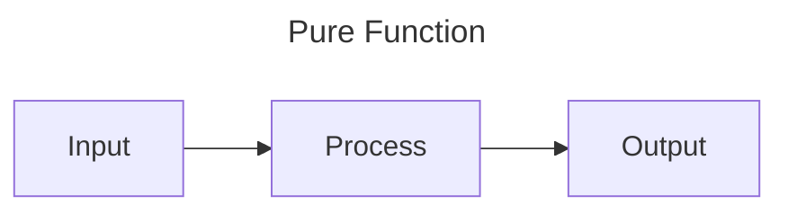
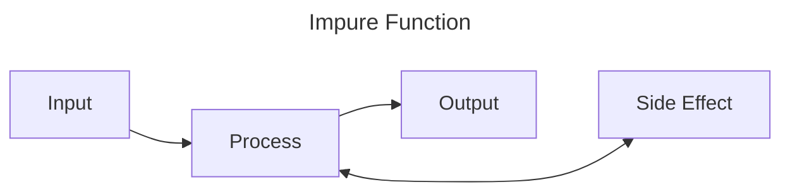

Functions
---------

Functions are reusable blocks of code. They have inputs, usually perform some sort of process, then have an output.

We've been using a function called `main` to run all of our programs and example so far. This is a special function
that is called as the program starts. We've also used a few other kinds of functions and methods (special functions
attached to data types) that are built into Rust. We can make and use our own functions too though.

Functions can be pure, or impure. A pure function takes an input, does some processing and returns an output. This makes
the function extremely predictable. Given the same input they will always produce the same output, and nothing else
within the system will change. 



An impure function, might not always produce the same output given the same input, or may have side effects within the
system, either changing something else in the system or having some other part of the system 



### Crating and calling functions

Functions are defined with the `fn` keyword (short for FuNction), followed by a name, followed by brackets `()` which
may or may not contain parameters, possibly followed by an arrow `->` and a return type (if no return type is specified
the return type is the Unit Type `()`, see the [data types chapter](./data-types.md)), and are completed by a code
block which is the body of the function.

So lets create the simplest possible function:

```rust
fn say_hello() {
    println!("Hello, world");
}

# fn main() {
#     say_hello();
# }
```

This function is called `say_hello`, it has no parameters and does not return anything.

### Passing Parameters

### Returning from Functions

### Ownership
