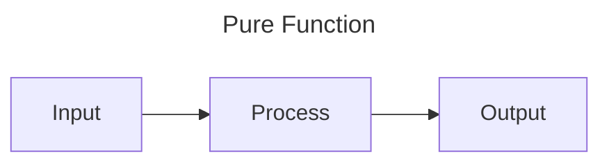
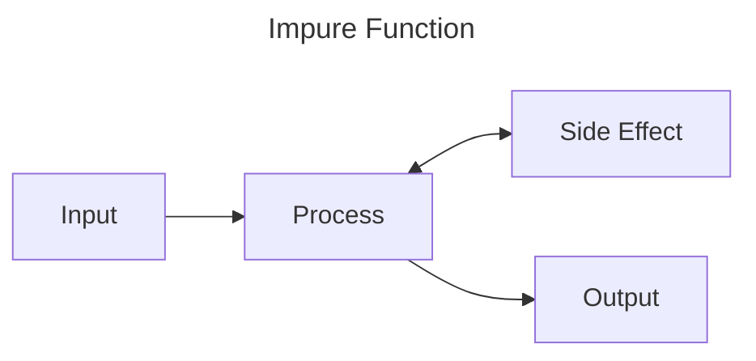

Functions
=========

Functions are reusable blocks of code. They have inputs, usually perform some sort of process, then have an output.

We've been using a function called `main` to run all of our programs and example so far. This is a special function
that is called as the program starts. We've also used a few other kinds of functions and methods (special functions
attached to data types) that are built into Rust. We can make and use our own functions too though.

Functions can be pure, or impure. A pure function takes an input, does some processing and returns an output. This makes
the function extremely predictable. Given the same input they will always produce the same output, and nothing else
within the system will change. 



An impure function, might not always produce the same output given the same input, or may have side effects within the
system, either changing something else in the system or having some other part of the system 



A Quick Note on Mutability
--------------------------

Up to now, we haven't needed to change any data once it's been created. By default, all variables in Rust are implicitly
"immutable", meaning that the values inside of them can not be changed.

This, for example, won't compile (try to run it to see the compiler output)

```rust,compile_fail
# fn main() {
let one = 1;
one = one + 1;
# println!("one = {one}");
# }
```

Immutability is good because it prevents data from being changed by mistake which, going on the name of the variable in
the above example, is obviously what's happened here (ie, it seems like `one` should probably not contain `2`).

It's good to use immutable variables as much as possible, but software needs to be able to process data. If we could
never mutate values, we'd always have to depend on creating copies like this:

```rust
# fn main() {
let one = 1;
let two = one + 1;
# println!("two = {two}");
# }
```

That's fine for small data but imagine we're processing large data like an image. Do we want to copy it every time we
make a single pixel change?

You can explicitly opt in to mutability by adding the word `mut` (pronounced "mute") in front of the variable name.

```rust
let mut message = "Hello".to_string();
message.push_str(", world!"); // Modify message by adding this data to the end
# println!("{message}");
```

Creating and calling functions
------------------------------

Functions are defined with the `fn` keyword (short for FuNction), followed by a name, followed by brackets `()` which
may or may not contain parameters, possibly followed by an arrow `->` and a return type (if no return type is specified
the return type is the Unit Type `()`, see the [data types chapter](./data-types.md)), and are completed by a code
block which is the body of the function.

So lets create the simplest possible function:

```rust
fn say_hello() {
    println!("Hello, world");
}

# fn main() {
#     say_hello();
# }
```

This function is called `say_hello`, it has no parameters and does not return anything. Because it writes to the
terminal, this function is considered to be impure.

We can call the function using its name and empty brackets.

```rust
# fn say_hello() {
#     println!("Hello, world");
# }
#
fn main() {
    say_hello();
}
```

You'll notice this function doesn't actually have any inputs or outputs. Let's start by providing an input.


Passing Parameters
------------------

```rust
fn say_hello(name: &str) {
    println!("Hello, {name}");
}

# fn main() {
#     say_hello("Yuki");
# }
```

Now the function has one input (we call it a parameter) called `name`. You can see that we also provide type information
for the parameter, in this case it's a string slice (`&str`). The parameter can be used as a variable within the
function, so we use it in our `println!`.

To pass the data into the function we place it between the brackets: 

```rust
# fn say_hello(name: &str) {
#     println!("Hello, {name}");
# }
#
fn main() {
    say_hello("Yuki");
}
```

We can have multiple parameters too. Parameters are ordered so when you call the function, you need to match the order
they're specified. For example:

```rust
fn say_hello_two(first_person: &str, second_person: &str) {
    println!("Hello, {first_person} and {second_person}");
}

fn main() {
    say_hello_two("Indra", "Yuki");
}
```

Returning from Functions
------------------------

Let's fix our function to remove the side effect. Instead of directly printing to the terminal from the function, we'll
return the string we want to display and move the side effect to main.

We'll make the following changes:
- We'll rename the function to reflect the change in behaviour (see [Best Practices](#best-practices) below)
- We'll add the return type (in this case `String`) to the function header, after `->`
- We'll create the String using the `format!` macro and store it in a variable `message` (note: the variable isn't
  necessary, it's just for clarity)
- We'll return the `message` from the function, remember the code blocks can be expressions, we don't need to explicitly
  write `return` (though we can), we just need to make the thing we want to return the last bit of the block and forgo
  the semicolon 

```rust
fn create_greeting(name: &str) -> String {
    let message = format!("Hello, {name}");
    message
}

fn main() {
    let greeting = create_greeting("Yuki");
    println!("{greeting}");
}
```

Recursion
---------

See also: [recursion](#recursion)

In Rust, functions can call other functions, like how our `main()` function calls our `create_greeting(...)` function in
the previous example. A function that calls itself is described as recursive. Take for example this method for finding
the nth number in the fibonacci sequence
```rust
fn find_fibonacci(n: u128) -> u128 {
    if n == 0 || n == 1 { // if n equals 0 or n equals 1
        n
    } else {
        find_fibonacci(n - 1) + find_fibonacci(n - 2)
    }
}
#
# fn main() {
#     let n = 11;
#     let fibonacci = find_fibonacci(n);
#     println!("The {n} value of fibonacci is {fibonacci}");
# }
```

> Note in this function that we use a boolean OR (`||`) in the `if` so the larger expression evaluates to true of either
> the left or right parts of the expression evaluate to true. I.e. the expression is true if n is equal to 0 OR if n is
> equal to 1.
>
> We also use the `if`/`else` as an expression so the return of the function is equal to the values in the `if`/`else`
> blocks. If the expression in the `if` is true, then we return `n`, otherwise we return the result of calling the same
> function with new parameters.

Because we call `find_fibonacci` inside of `find_fibonacci`, this is a recursion. Each time we call the function in this
way, we add another layer on [the stack](./memory.md/#the-stack). The stack is finite, so if we give the function a
large enough number, it will eventually run out of space in the stack, causing a stack overflow, and you'll see
something like:

```text
thread 'main' has overflowed its stack
```

> Its worth noting I had to manually set the stack size to something unreasonably small 

Rust does support "tail recursion" which is technique for turning a recursive function into a loop at compile time. This
not only minimises stack usage to effectively a single function call but is also much faster. However, I think this is
an overrated feature. In any language that supports tail recursion, it's hard to guarantee the compiler will optimise
this way, and it's easy to break. My recommendation is if you need to recurse a _lot_, then consider whether you can
manually rewrite your function as a loop instead of depending on a compiler optimization.

Ownership
---------

### Memory Management Primer

Variables in Rust have to live somewhere in physical memory. This primarily comes down to the Stack, the Heap and the
binary (for a deeper explanation, see the [chapter on memory](memory.md)). The Heap can be thought of as managed. You 
ask the operating system (or other memory manager) to "allocate" you a block of memory to use for writing to and reading
from, before finally "freeing" that block and returning the memory to the operating system.

In some programming languages, this memory is managed manually by you. You have to ask for the memory and free it
yourself. This leads to some problems:
- What happens if you try to use memory that wasn't allocated?
- What happens if you try to use memory that you already freed?
- What happens if you try to store more data than fits?

Not only is it surprisingly easy to make mistakes here, the consequences can be severe: around 70% of all security
vulnerabilities are caused by accidental misuse of memory.

In order to get around these problems, some programming languages use an automated method of memory management called
garbage collection. In this method, you, the software engineer, don't have to think about the actions required to get
or return memory to/from the operating system. Instead, as memory is allocated, the garbage collector built into the
language, will monitor to see which parts of your program are actively looking at that bit of memory, through a process
called reference counting. Once the number of places using that data has dropped to zero, the garbage collector can
safely free the memory.

This is much safer than manually managing the memory yourself, but comes with some of its own problems:
- The garbage collector requires additional resources to manage memory
  - This includes CPU time to do the work but in some cases can also require significantly more memory
- Managing memory by proxy is less efficient than managing it directly, meaning its slower
- You have limited to no control over what the garbage collector does or when it does it, this can have big negative
  impacts to performance at uncontrollable times

Rust's method of memory management is a little different. It's low level, giving you the speed of manual memory
management, but its mechanisms are hidden behind abstractions that mitigate its risks. It's certainly not as easy to
learn, but once you get your head around it, it makes a lot of sense.

### Ownership

In Rust, all data is "owned". When the variable that "owns" the data goes out of scope, the data is dropped. This means
that if the data was stored on the Heap, then that bit of memory is immediately freed.

Let's have a play with this, first, lets look at the scope aspect of ownership:

```rust,compile_fail
fn main() {
  let a = 'a'; // We create `a` in the outer scope of "main"

  { // Start of a new block, starting a nested scope

    println!("{a}"); // This works as `a` is in scope

    let b = 'b'; // We create `b` in the inner scope of this code block
    println!("{b}"); // This works as `b` is in scope

  } // End of the block, b goes out of scope

  println!("{a}"); // This still works as `a` is still in scope
  println!("{b}"); // This does not work as `b` went out of scope
}
```

We can see that once a variable is out of scope, it can't be used. If you run the above example (remember, you can do
that in this book by mousing over the example and hitting the play button), you'll see it won't compile and (amongst
a few other bits) gives you this message:

```text
error[E0425]: cannot find value `b` in this scope
  --> src/main.rs:14:14
```

Which tells us _exactly_ what's wrong! Rust's compiler messages generally amazing, especially when it comes to working
with ownership, so it's worth getting used to how Rust presents its errors.

Next, lets look at how data can only be "owned" by one thing at a time:


```rust,compile_fail
# fn main() {
let a = "hello".to_string(); // We create some data and give it to `a`
let b = a;                   // We give the data in `a` to `b`, transfering ownership
println!("{b}");             // This would be fine as b owns "hello"
println!("{a}");             // This won't compile, the data "moved" from `a` to `b`
# }
```

The statement `let b = a;` "moves" ownership of the string from `a` to `b`. Normally we wouldn't "move" data in this way
(spoilers: this is, after all, a chapter on functions), but it neatly shows that the data can't be owned by multiple
variables at once.

### Move Semantics

You might have noticed that we swapped from `char`s in the first ownership example to a `String` in the second. This is
because there are two mechanisms at play: "Move" and "Copy".

Let's try the same code with chars:

```rust
# fn main() {
let a = '雪';    // We create some data and give it to `a`
let b = a;       // We set b to be equal to a
println!("{b}"); // Prints 雪 
println!("{a}"); // Also prints 雪
# }
```

This works! But String didn't... 🤔

The reason for this is that `char` is Copy, that is to say that it has the `Copy` trait. We'll talk more about Traits
in a future chapter, but essentially Traits provide behaviour to Data. Things can have the `Copy` trait applied to them
if they can be trivially copied and this usually (always?) means the data exists on the stack. The reason for this is
all the memory allocation and freeing stuff from above.

When data has the Copy trait, instead of being moved from one variable to another, it's copied. This mechanism on data
that is Copy is implicit. Data that does not or can not implement Copy may still be duplicated if it implements the
trait `Clone`, which provides the `.clone()` method. We'll talk more about implementing traits in the traits section,
but `String` already implements this so here's how to use it: 

```rust
# fn main() {
let a = "hello".to_string(); // We create some data and give it to `a`
let b = a.clone();           // Allocates memory on the heap and copies the data into it
println!("{b}");             // Prints "hello"
println!("{a}");             // Also prints "hello"
# }
```

You'll also note that we used a full fat `String` here, not a string slice reference. Here's what that would look like:

```rust
# fn main() {
let a = "hello";   // `a` is a reference to data that exists in the binaries "data"
let b = a;         // references are Copy so the reference is copied from a to b
println!("{b}");   // Prints "hello"
println!("{a}");   // Also prints "hello"
# }
```

Because `"hello"` exists inside the binaries data you can not "Own" it. Ownership would imply that once its no longer
used it can be freed, but as its part of the binary, that wouldn't sense. Instead, we just get a reference to where the
value exists in memory. This reference is also immutable, you can't change values in the binary. Immutable references
_are_ Copy though.

What does this have to do with functions though?

Functions and Ownership
-----------------------

When we pass data into functions through the use of parameters, the data follows the rules of move semantics.

Let's go back to our `create_greeting()` function. Instead of passing in a string slice reference, what would happen if
we passed in a `String`?

```rust,compile_fail
fn create_greeting(name: String) -> String {
    let message = format!("Hello, {name}");
    message
}

fn main() {
  let yuki = "Yuki".to_string();
  let message = create_greeting(yuki);
  println!("{message}"); // This would be fine but...
  println!("{yuki}"); // This won't compile
}
```

In the above example, we moved ownership of the data stored in the variable `yuki` into the parameter `name` in the
function `create_greeting`. This means after the function the variable `yuki` can no longer be used.

Because the `format!` macro does not take ownership of the data in `name`, so we could return both the message _and_ the
original `String` data using a tuple.

```rust
fn create_greeting(name: String) -> (String, String) {
    let message = format!("Hello, {name}");
    (message, name)
}

fn main() {
  let yuki = "Yuki".to_string();
  let (message, yuki) = create_greeting(yuki);
  println!("{message}"); 
  println!("{yuki}"); // This works again
}
```

We've changed our `create_greeting()` function to return a tuple that includes both strings. When the function returns
we destructure the tuple (see [destructuring with patterns](control-flow.md/#patterns)) into two new variables, 
`message` and `yuki`. Note: this new `yuki` is a different variable from the old `yuki`, this is called "shadowing".

This is obviously a terrible way to deal with ownership. Going back to our original function, you can see that we are
taking a reference to a string slice instead. The `String` type can be "dereferenced" into a reference to a string slice
(remember the internal representation of a String is the same as a string slice), so we can create a reference to our
`yuki` `String` using an ampersand:

```rust
// Changed back to taking a &str
fn create_greeting(name: &str) -> String {
    let message = format!("Hello, {name}");
    message
}

fn main() {
  let yuki = "Yuki".to_string();
  let message = create_greeting(&yuki);
  println!("{message}");
  println!("{yuki}"); // Yuki's ownership was never moved so this now works
}
```

Let's say we wanted our function to modify the string instead. Ideally we'd want to avoid modifying data that's passed
to a function but sometimes that's not possible, if you need to do it you can pass a mutable reference.

```rust
// Changed back to taking a &str
fn create_greeting(greeting: &mut String, name: &str)  {
    greeting.push_str(", ");
    greeting.push_str(name);
}

fn main() {
  let mut greeting = "Hello".to_string();
  let name = "Yuki".to_string();
  create_greeting(&mut greeting, &name);
  println!("{greeting}");
}
```

Some things to note:
- In order to mutate greeting via a mutable reference, the variable itself must also be mutable: `let mut greeting ...`
- When we pass the reference, we are explicit that we are allowing the reference to be mutable too:
  `create_greeting(&mut greeting, ...)`
- The function takes a mutable reference to a String, not a string slice, as string slices are not mutable, but Strings 
  are.

Finally, when it comes to references, you can have as many immutable references to a value as you like, OR a single
mutable reference.

Lifetimes
---------

So far so clear, but it turns out that keeping track of those references is actually quite hard.

Let's create a function that takes a reference to a string and returns two parts to that string:

```rust
fn split(input: &str, at: usize) -> (&str, &str) {
  let up_to = std::cmp::min(at, input.len()); // Prevent out of bounds
  (&input[..up_to], &input[up_to..])
}

fn main() {
  let input = "yuki".to_string();
  let (left, right) = split(&input, 2);

  println!("Input: {input}"); // yuki
  println!("Left:  {left}");  // yu
  println!("Right: {right}"); // ki
}
```

The function split takes a reference to a string, a point to split at, and the returns everything on the left of the
split and everything on the right. The cool thing here is that the string isn't duplicated, the values `left` and 
`right` are references that point to the inside of our input string! 

How does Rust know that though? Let's confuse it a bit.

Instead of splitting at a particular point, we'll find a sub string inside the input string, then split around that:

```rust,compile_fail
fn split(input: &str, sub_string: &str) -> (&str, &str) {
  if let Some(found_at) = input.find(sub_string) {
    (&input[..found_at], &input[found_at + 1..])
  } else {
    (&input[..], &input[input.len()..])
  }
}

fn main() {
  let input = "yuki".to_string();
  let sub_string = "uk";
  let (left, right) = split(&input, sub_string);

  println!("Input: {input}"); // yuki
  println!("Left:  {left}"); // y
  println!("Right: {right}"); // i
}
```

This example won't compile, we get the error: `expected named lifetime parameter`, what does that mean?

We also get guidance from the Rust compiler on how to fix our problem, and what it suggests will work, but once you
understand the problem, you'll see there's a better way to solve it.

A lifetime is Rust's way of tracking reference usage. A reference needs to be tied back to its owning variable and this
relationship must be understood at compile time. The way I like to visualise this is with a kite.

Remember the stack? Let's tie what we know about ownership to what we know about the stack.

- Some data is stored on the stack, some is stored on the heap
- Heap data is tied back to variables on the stack that "own" the heap data
- As we enter a function, all the space required for the stack data is added to the top of the stack
- Further functions go up the stack
- As functions come to an end they are removed from the top of the stack
- Owned data that is not returned down the stack is freed

When it comes to references, we need to make sure that a reference to owned data does not out live the owned data.

For example, lets create a string on the heap called `my_string`. We'll then return a reference to that string, but not
the string itself. This would mean that when the function comes to an end, the variable `my_string` goes out of scope,
so the data that it owns on the Heap is freed... what would our reference point at now? Luckily Rust won't let us do
this:

```rust,compile_fail
fn bad() -> &str {
  let my_string = "Oh no!".to_string();
  &my_string
}
```

In order to prevent this, Rust tracks the lifetimes of each reference and its owned data. It can often do this 
automatically. In the first version of our function Rust can see that only one reference enters the function, no other
references are in play, so Rust knows that the two references that are returned _must_ be tied to the same data as the
incoming reference.

In the second version of our function, we pass two references in, now Rust is now less sure about which data the 
returned references should be tied to. The suggestion the Rust compiler gives us is to tie all the references to the
same lifetime. This actually is a valid approach as Rust will use the shortest living bit of data to tie the references
to.

Let's do what it says. Rust lifetimes are annotated with generic labels. If we're being lazy we might use a single 
lettered label like `'a`, though if a lot of lifetimes are at play it's definitely better to use longer, clearer labels.

We'll change the header of our function to include the lifetime `'a`. First we tell Rust we want to use a lifetime by
putting it inside triangle brackets after the function name. Then we mark each reference with that lifetime.

```rust
fn split<'a>(input: &'a str, sub_string: &'a str) -> (&'a str, &'a str) {
    // ...
#   if let Some(found_at) = input.find(sub_string) {
#     (&input[..found_at], &input[found_at + 1..])
#   } else {
#     (&input[..], &input[input.len()..])
#   }
}
# 
# fn main() {
#   let input = "yuki".to_string();
#   let sub_string = "uk";
#   let (left, right) = split(&input, sub_string);
# 
#   println!("Input: {input}"); // yuki
#   println!("Left:  {left}"); // y
#   println!("Right: {right}"); // i
# }
```

You can run the above and see this example works just fine, however, it's not ideal. We've tied all the references to
the same lifetime. The following shows that we can't compile code that we know should work.

```rust,compile_fail
# fn split<'a>(input: &'a str, sub_string: &'a str) -> (&'a str, &'a str) {
#     if let Some(found_at) = input.find(sub_string) {
#         (&input[..found_at], &input[found_at + 1..])
#     } else {
#         (&input[..], &input[input.len()..])
#     }
# }
#
# fn main() {
let input = "yuki".to_string();

let (left, right) = {
    let sub_string = "uk".to_string();
    split(&input, &sub_string)
};

println!("Input: {input}"); // yuki
println!("Left:  {left}"); // y
println!("Right: {right}"); // i
# }
```

This is contrived but here we've created an inner scope for our sub string. When that scope ends, that substring will be
freed. You and I know that the left and right references are tied to the input variable in the outer scope, but we told
Rust that it should tie all the lifetimes together. Since the sub string lasts the least amount of time, that's the 
lifetime it used.

To fix this problem we can just remove the lifetime annotation from the sub_string parameter. Now everything works
as we'd expect:


```rust
fn split<'a>(input: &'a str, sub_string: &str) -> (&'a str, &'a str) {
  // ...
#   if let Some(found_at) = input.find(sub_string) {
#     (&input[..found_at], &input[found_at + 1..])
#   } else {
#     (&input[..], &input[input.len()..])
#   }
}

fn main() {
    let input = "yuki".to_string();
    
    let (left, right) = {
        let sub_string = "uk".to_string();
        split(&input, &sub_string)
    };
    
    println!("Input: {input}"); // yuki
    println!("Left:  {left}"); // y
    println!("Right: {right}"); // i
}
```

References and lifetimes get really tricky. Here's how I like to think about them. Imagine a person flying a kite. The
person is the owner of the data, the kite is the reference, and the string tying them together is the lifetime.

The kite can go up and down the stack freely, but it can't go below where the person is standing, that's the equivalent
of the ground.

Multiple people can fly their kites through the same functions, and each one has its own reference.

Its even possible to entwine the kites. Imagine a function that takes two string references and returns the longest.
This is like a function that accepts two kites but only the largest is returned. Because you don't know who that kite
belongs to, it can't go below the person standing highest on the stack.

Lifetimes can be incredibly powerful, there's no need to fear them. One amazing example is that you can have a string
that contains some data, for example it could be a serialized format like JSON or YAML, or it could be something like
an Advent of Code input string. Lifetimes mean that you bring that String into your program, allocating the memory for
it once, then turn it into a complex data structure. So long as the original String exists, the data structure can need
not allocate any further memory, which is incredibly efficient.

```rust
struct User<'a> {
  name: &'a str,
  fur_color: &'a str,
}


fn parse_user<'a>(input: &'a str) -> User<'a> {
    // ...
#     // ok, you caught me, this isn't a real parser
#     let mut iter = input.lines();
#     let name = &iter.next().unwrap()[6..];
#     let fur_color = &iter.next().unwrap()[4..];
#     User {
#       name,
#       fur_color,
#     }
}

fn main() {
    let user = "name: Yuki
fur: white"
            .to_string();
    let User { name, fur_color } = parse_user(&user);
    println!("User {name} is a {fur_color} cat");
}
```

Best Practices
--------------

Here are some best practices when it comes to working with functions:

- Create a function whenever a section of code can be described in a few words
- Functions should only do one thing, avoid big branches inside functions
- Keep functions short, but not too short
  - Functions should be set of instructions grouped together, too few, and it may not be worth the function, too many, 
    and it may need to be broken down into more functions
- Do not take ownership unless you expressly need to own the data
- _Try_ to avoid mutable parameters
