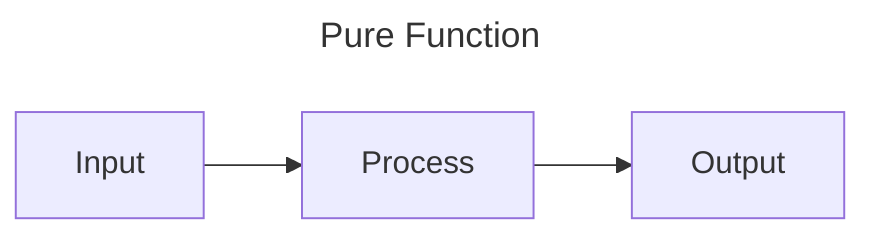
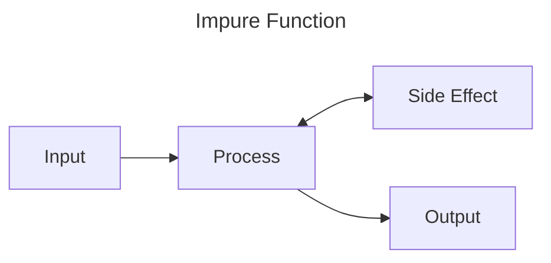

Functions
=========

Functions are reusable blocks of code. They have inputs, usually perform some sort of process, then have an output.

We've been using a function called `main` to run all of our programs and example so far. This is a special function
that is called as the program starts. We've also used a few other kinds of functions and methods (special functions
attached to data types) that are built into Rust. We can make and use our own functions too though.

Functions can be pure, or impure. A pure function takes an input, does some processing and returns an output. This makes
the function extremely predictable. Given the same input they will always produce the same output, and nothing else
within the system will change. 



An impure function, might not always produce the same output given the same input, or may have side effects within the
system, either changing something else in the system or having some other part of the system 



Creating and calling functions
------------------------------

Functions are defined with the `fn` keyword (short for FuNction), followed by a name, followed by brackets `()` which
may or may not contain parameters, possibly followed by an arrow `->` and a return type (if no return type is specified
the return type is the Unit Type `()`, see the [data types chapter](./data-types.md)), and are completed by a code
block which is the body of the function.

So lets create the simplest possible function:

```rust
fn say_hello() {
    println!("Hello, world");
}

# fn main() {
#     say_hello();
# }
```

This function is called `say_hello`, it has no parameters and does not return anything. Because it writes to the
terminal, this function is considered to be impure.

We can call the function using its name and empty brackets.

```rust
# fn say_hello() {
#     println!("Hello, world");
# }
#
fn main() {
    say_hello();
}
```

You'll notice this function doesn't actually have any inputs or outputs. Let's start by providing an input.


Passing Parameters
------------------

```rust
fn say_hello(name: &str) {
    println!("Hello, {name}");
}

# fn main() {
#     say_hello("Yuki");
# }
```

Now the function has one input (we call it a parameter) called `name`. You can see that we also provide type information
for the parameter, in this case it's a string slice (`&str`). The parameter can be used as a variable within the
function, so we use it in our `println!`.

To pass the data into the function we place it between the brackets: 

```rust
# fn say_hello(name: &str) {
#     println!("Hello, {name}");
# }
#
fn main() {
    say_hello("Yuki");
}
```

We can have multiple parameters too. Parameters are ordered so when you call the function, you need to match the order
they're specified. For example:

```rust
fn say_hello_two(first_person: &str, second_person: &str) {
    println!("Hello, {first_person} and {second_person}");
}

fn main() {
    say_hello_two("Indra", "Yuki");
}
```

Returning from Functions
------------------------

Let's fix our function to remove the side effect. Instead of directly printing to the terminal from the function, we'll
return the string we want to display and move the side effect to main.

We'll make the following changes:
- We'll rename the function to reflect the change in behaviour (see [Best Practices](#best-practices) below)
- We'll add the return type (in this case `String`) to the function header, after `->`
- We'll create the String using the `format!` macro and store it in a variable `message` (note: the variable isn't
  necessary, it's just for clarity)
- We'll return the `message` from the function, remember the code blocks can be expressions, we don't need to explicitly
  write `return` (though we can), we just need to make the thing we want to return the last bit of the block and forgo
  the semicolon 

```rust
fn create_greeting(name: &str) -> String {
    let message = format!("Hello, {name}");
    message
}

fn main() {
    let greeting = create_greeting("Yuki");
    println!("{greeting}");
}
```

Recursion
---------

See also: [recursion](#recursion)

In Rust, functions can call other functions, like how our `main()` function calls our `create_greeting(...)` function in
the previous example. A function that calls itself is described as recursive. Take for example this method for finding
the nth number in the fibonacci sequence
```rust
fn find_fibonacci(n: u128) -> u128 {
    if n == 0 || n == 1 { // if n equals 0 or n equals 1
        n
    } else {
        find_fibonacci(n - 1) + find_fibonacci(n - 2)
    }
}
#
# fn main() {
#     let n = 11;
#     let fibonacci = find_fibonacci(n);
#     println!("The {n} value of fibonacci is {fibonacci}");
# }
```

> Note in this function that we use a boolean OR (`||`) in the `if` so the larger expression evaluates to true of either
> the left or right parts of the expression evaluate to true. I.e. the expression is true if n is equal to 0 OR if n is
> equal to 1.
>
> We also use the `if`/`else` as an expression so the return of the function is equal to the values in the `if`/`else`
> blocks. If the expression in the `if` is true, then we return `n`, otherwise we return the result of calling the same
> function with new parameters.

Because we call `find_fibonacci` inside of `find_fibonacci`, this is a recursion. Each time we call the function in this
way, we add another layer on [the stack](./memory.md/#the-stack). The stack is finite, so if we give the function a
large enough number, it will eventually run out of space in the stack, causing a stack overflow, and you'll see
something like:

```text
thread 'main' has overflowed its stack
```

> Its worth noting I had to manually set the stack size to something unreasonably small 

Rust does support "tail recursion" which is technique for turning a recursive function into a loop at compile time. This
not only minimises stack usage to effectively a single function call but is also much faster. However, I think this is
an overrated feature. In any language that supports tail recursion, it's hard to guarantee the compiler will optimise
this way, and it's easy to break. My recommendation is if you need to recurse a _lot_, then consider whether you can
manually rewrite your function as a loop instead of depending on a compiler optimization.

Ownership
---------

### Memory Management Primer

Variables in Rust have to live somewhere in physical memory. This primarily comes down to the Stack, the Heap and the
binary (for a deeper explanation, see the [chapter on memory](memory.md)). The Heap can be thought of as managed. You 
ask the operating system (or other memory manager) to "allocate" you a block of memory to use for writing to and reading
from, before finally "freeing" that block and returning the memory to the operating system.

In some programming languages, this memory is managed manually by you. You have to ask for the memory and free it
yourself. This leads to some problems:
- What happens if you try to use memory that wasn't allocated?
- What happens if you try to use memory that you already freed?
- What happens if you try to store more data than fits?

Not only is it surprisingly easy to make mistakes here, the consequences can be severe: around 70% of all security
vulnerabilities are caused by accidental misuse of memory.

In order to get around these problems, some programming languages use an automated method of memory management called
garbage collection. In this method, you, the software engineer, don't have to think about the actions required to get
or return memory to/from the operating system. Instead, as memory is allocated, the garbage collector built into the
language, will monitor to see which parts of your program are actively looking at that bit of memory, through a process
called reference counting. Once the number of places using that data has dropped to zero, the garbage collector can
safely free the memory.

This is much safer than manually managing the memory yourself, but comes with some of its own problems:
- The garbage collector requires additional resources to manage memory
  - This includes CPU time to do the work but in some cases can also require significantly more memory
- Managing memory by proxy is less efficient than managing it directly, meaning its slower
- You have limited to no control over what the garbage collector does or when it does it, this can have big negative
  impacts to performance at uncontrollable times

Rust's method of memory management is a little different. It's low level, giving you the speed of manual memory
management, but its mechanisms are hidden behind abstractions that mitigate its risks. It's certainly not as easy to
learn, but once you get your head around it, it makes a lot of sense.

### Ownership

In Rust, all data is "owned". When the variable that "owns" the data goes out of scope, the data is dropped. This means
that if the data was stored on the Heap, then that bit of memory is immediately freed.

Let's have a play with this, first, lets look at the scope aspect of ownership:

```rust,compile_fail
fn main() {
  let a = 'a'; // We create `a` in the outer scope of "main"

  { // Start of a new block, starting a nested scope

    println!("{a}"); // This works as `a` is in scope

    let b = 'b'; // We create `b` in the inner scope of this code block
    println!("{b}"); // This works as `b` is in scope

  } // End of the block, b goes out of scope

  println!("{a}"); // This still works as `a` is still in scope
  println!("{b}"); // This does not work as `b` went out of scope
}
```

We can see that once a variable is out of scope, it can't be used. If you run the above example (remember, you can do
that in this book by mousing over the example and hitting the play button), you'll see it won't compile and (amongst
a few other bits) gives you this message:

```text
error[E0425]: cannot find value `b` in this scope
  --> src/main.rs:14:14
```

Which tells us _exactly_ what's wrong! Rust's compiler messages generally amazing, especially when it comes to working
with ownership, so it's worth getting used to how Rust presents its errors.

Next, lets look at how data can only be "owned" by one thing at a time:


```rust,compile_fail
# fn main() {
let a = "hello".to_string(); // We create some data and give it to `a`
let b = a;                   // We give the data in `a` to `b`, transfering ownership
println!("{b}");             // This would be fine as b owns "hello"
println!("{a}");             // This won't compile, the data "moved" from `a` to `b`
# }
```

The statement `let b = a;` "moves" ownership of the string from `a` to `b`. Normally we wouldn't "move" data in this way
(spoilers: this is, after all, a chapter on functions), but it neatly shows that the data can't be owned by multiple
variables at once.

### Move Semantics

You might have noticed that we swapped from `char`s in the first ownership example to a `String` in the second. This is
because there are two mechanisms at play: "Move" and "Copy".

Let's try the same code with chars:

```rust
# fn main() {
let a = '雪';    // We create some data and give it to `a`
let b = a;       // We set b to be equal to a
println!("{b}"); // Prints 雪 
println!("{a}"); // Also prints 雪
# }
```

The reason for this is that `char` is Copy, that is to say that it has the `Copy` trait. We'll talk more about Traits
in a future chapter, but essentially Traits provide behaviour to Data. Things can have the Copy applied to them if they
can be trivially copied and this usually (always?) means the data exists on the stack. The reason for this is all the
memory allocation and freeing stuff from above.

When data has the Copy trait, instead of being moved from one variable to another, it's copied. This mechanism on data
that is Copy is implicit. Data that does not or can not implement Copy may still be duplicated if it implements the
trait `Clone`, which provides the `.clone()` method.

```rust
# fn main() {
let a = "hello".to_string(); // We create some data and give it to `a`
let b = a.clone();           // Allocates memory on the heap and copies the data into it
println!("{b}");             // Prints "hello"
println!("{a}");             // Also prints "hello"
# }
```

Best Practices
--------------

Here are some best practices when it comes to working with functions:

- Create a function whenever a section of code can be described in a few words
- Functions should only do one thing, avoid big branches inside functions
- Keep functions short, but not too short
  - Functions should be set of instructions grouped together, too few, and it may not be worth the function, too many, 
    and it may need to be broken down into more functions
- Do not take ownership unless you expressly need to own the data
- _Try_ to avoid mutable parameters
