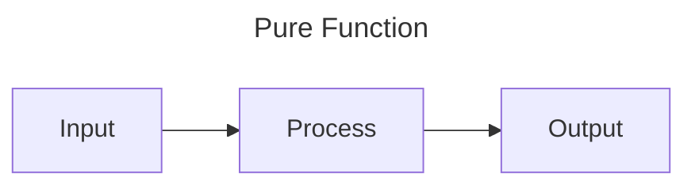
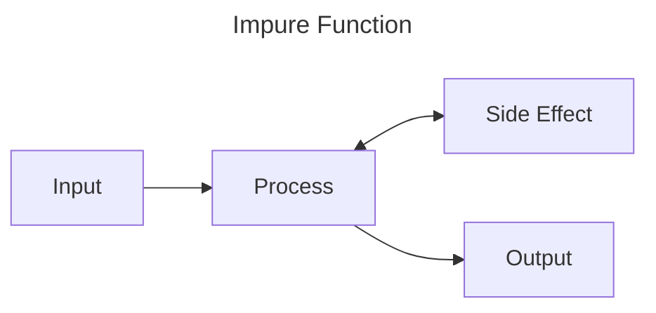

Functions
=========

Functions are reusable blocks of code. They have inputs, usually perform some sort of process, then have an output.

We've been using a function called `main` to run all of our programs and example so far. This is a special function
that is called as the program starts. We've also used a few other kinds of functions and methods (special functions
attached to data types) that are built into Rust. We can make and use our own functions too though.

Functions can be pure, or impure. A pure function takes an input, does some processing and returns an output. This makes
the function extremely predictable. Given the same input they will always produce the same output, and nothing else
within the system will change. 



An impure function, might not always produce the same output given the same input, or may have side effects within the
system, either changing something else in the system or having some other part of the system 



Creating and calling functions
------------------------------

Functions are defined with the `fn` keyword (short for FuNction), followed by a name, followed by brackets `()` which
may or may not contain parameters, possibly followed by an arrow `->` and a return type (if no return type is specified
the return type is the Unit Type `()`, see the [data types chapter](./data-types.md)), and are completed by a code
block which is the body of the function.

So lets create the simplest possible function:

```rust
fn say_hello() {
    println!("Hello, world");
}

# fn main() {
#     say_hello();
# }
```

This function is called `say_hello`, it has no parameters and does not return anything. Because it writes to the
terminal, this function is considered to be impure.

We can call the function using its name and empty brackets.

```rust
# fn say_hello() {
#     println!("Hello, world");
# }
#
fn main() {
    say_hello();
}
```

You'll notice this function doesn't actually have any inputs or outputs. Let's start by providing an input.


Passing Parameters
------------------

```rust
fn say_hello(name: &str) {
    println!("Hello, {name}");
}

# fn main() {
#     say_hello("Yuki");
# }
```

Now the function has one input (we call it a parameter) called `name`. You can see that we also provide type information
for the parameter, in this case it's a string slice (`&str`). The parameter can be used as a variable within the
function, so we use it in our `println!`.

To pass the data into the function we place it between the brackets: 

```rust
# fn say_hello(name: &str) {
#     println!("Hello, {name}");
# }
#
fn main() {
    say_hello("Yuki");
}
```

We can have multiple parameters too. Parameters are ordered so when you call the function, you need to match the order
they're specified. For example:

```rust
fn say_hello_two(first_person: &str, second_person: &str) {
    println!("Hello, {first_person} and {second_person}");
}

fn main() {
    say_hello_two("Indra", "Yuki");
}
```

Returning from Functions
------------------------

Let's fix our function to remove the side effect. Instead of directly printing to the terminal from the function, we'll
return the string we want to display and move the side effect to main.

We'll make the following changes:
- We'll rename the function to reflect the change in behaviour (see [Best Practices](#best-practices) below)
- We'll add the return type (in this case `String`) to the function header, after `->`
- We'll create the String using the `format!` macro and store it in a variable `message` (note: the variable isn't
  necessary, it's just for clarity)
- We'll return the `message` from the function, remember the code blocks can be expressions, we don't need to explicitly
  write `return` (though we can), we just need to make the thing we want to return the last bit of the block and forgo
  the semicolon 

```rust
fn create_greeting(name: &str) -> String {
    let message = format!("Hello, {name}");
    message
}

fn main() {
    let greeting = create_greeting("Yuki");
    println!("{greeting}");
}
```

Recursion
---------

See also: [recursion](#recursion)

In Rust, functions can call other functions, like how our `main()` function calls our `create_greeting(...)` function in
the previous example. A function that calls itself is described as recursive. Take for example this method for finding
the nth number in the fibonacci sequence
```rust
fn find_fibonacci(n: u128) -> u128 {
    if n == 0 || n == 1 { // if n equals 0 or n equals 1
        n
    } else {
        find_fibonacci(n - 1) + find_fibonacci(n - 2)
    }
}
#
# fn main() {
#     let n = 11u8;
#     let fibonacci = find_fibonacci(n);
#     println!("The {n} value of fibonacci is {fibonacci}");
# }
```

> Note in this function that we use a boolean OR (`||`) in the `if` so the larger expression evaluates to true of either
> the left or right parts of the expression evaluate to true. I.e. the expression is true if n is equal to 0 OR if n is
> equal to 1.
>
> We also use the `if`/`else` as an expression so the return of the function is equal to the values in the `if`/`else`
> blocks. If the expression in the `if` is true, then we return `n`, otherwise we return the result of calling the same
> function with new parameters.

Because we call `find_fibonacci` inside of `find_fibonacci`, this is a recursion. Each time we call the function in this
way, we add another layer on [the stack](./memory.md/#the-stack). The stack is finite, so if we give the function a
large enough number, it will eventually run out of space in the stack, causing a stack overflow, and you'll see
something like:

```text
thread 'main' has overflowed its stack
```

Rust does support "tail recursion" which is technique for turning a recursive function into a loop at compile time. This
not only minimises stack usage to effectively a single function call but is also much faster. However, I think this is
an overrated feature. In any language that supports tail recursion, it's hard to guarantee the compiler will optimise
this way, and it's easy to break. My recommendation is if you need to recurse a _lot_, then consider whether you can
manually rewrite your function as a loop instead of depending on a compiler optimization.

Impl
----

As you can imagine, you can pass your own data types into functions, and typically that's fine, but there are some
issues, take the example below:

```rust
struct User {
    name: String,
    fur_color: String,
}

fn to_string(user: User) -> String {
    let User { name, fur_color } = user;
    format!("User name: {name}\nUser fur color: {fur_color}")
}

fn main() {
    let yuki = User {
        name: "Yuki".to_string(),
        fur_color: "White".to_string(),
    };
    println!("{}", to_string(yuki));
}
```

We have a nicely named function that does what it says, taking a User and turning it into a string, however, because
there is no function overloading in Rust (you are unable to have multiple functions with the same name but different
parameter lists), we can only have this one `to_string` function in scope at any time.

There are a few ways around this: in the case where the types are similar enough, you might be able to use a generic,
you could "rename" the function using `as` (we'll talk about that more in the section on modules), or you could rename
the function to something even more specific such as `user_to_string`...

Or, you could make the function part of the implementation of the type itself using an `impl` block. This will make the
function a part of the `User` type itself, and can be used to make functions called from `User` or on an instantiated
object like `yuki`.

Let's make an impl block starting with a function that provides an easier way to create a user:

```rust
struct User {
    name: String,
    fur_color: String,
}

impl User {
    fn new(name: String, fur_color: String) -> Self {
        User {
            name,
            fur_color,
        }
    }
}

#fn to_string(user: User) -> String {
#    let User { name, fur_color } = user;
#    format!("User name: {name}\nUser fur color: {fur_color}")
#}
#
fn main() {
    let yuki = User::new("Yuki".to_string(), "White".to_string());
    println!("{}", to_string(yuki));
}
```

The function `new` is called from the `User` type, and returns `Self`, this is a special keyword meaning the type that
is being used for the call, which in this case is `User`. So, when we call `User::new` with the parameters for `name`
and `fur_color`, it will return a new `User` object with those fields filled in. You'll also notice that when the
properties of the object are the same as the variables being used to set them, we don't need to add the colon, eg, you
don't need to do `name: name`, just putting `name` is fine.

You can also create "methods", which are functions that can be called on the instantiated data. We do this by making the
first parameter `self`, `&self` or `&mut self`. We'll talk more about the difference between these in the
[generic functions](#generic-functions) section below.

For now, we'll replicate the existing behaviour of our `to_string` function into the `User` implementation:

```rust
struct User {
    name: String,
    fur_color: String,
}

impl User {
    fn new(name: String, fur_color: String) -> Self {
        // ...
#         User {
#             name,
#             fur_color,
#         }
    }
  
    fn to_string(self) -> String {
        let User { name, fur_color } = self;
        format!("User name: {name}\nUser fur color: {fur_color}")
    }
}

fn main() {
    let yuki = User::new("Yuki".to_string(), "White".to_string());
    println!("{}", yuki.to_string());
}
```

We moved the function into the impl block, changed the first parameter from `user: User` to just `self`, we don't need
to specify the type. We also changed the way we call the function from `to_string(yuki)` to `yuki.to_string()`.

Traits
------

`impl` is cool, but we can take it a step further and define behaviour that can be implemented for multiple types.

For example, lets say that we have a similar type to our `User` type called `Admin`. 

```rust,noplayground
struct User {
    name: String,
    fur_color: String,
}

struct Admin {
    name: String,
}
```

We might want both `User` and `Admin` to have the method `to_string`. We can define it in a trait.

```rust
trait ExampleToString {
    fn to_string(self) -> String;
}
```

We don't need to define the body of the function (though you can, if you want to provide some default behaviour), we 
just need to describe its properties and return type. We can then implement that trait for a given type using
`impl <trait> for <type>`.


```rust
# struct User {
#     name: String,
#     fur_color: String,
# }
# 
# impl User {
#     fn new(name: String, fur_color: String) -> Self {
#         User {
#             name,
#             fur_color,
#         }
#     }
# }
# 
# trait ExampleToString {
#     fn to_string(self) -> String;
# }
#
impl ExampleToString for User {
    fn to_string(self) -> String {
        let User { name, fur_color } = self;
        format!("User name: {name}\nUser fur color: {fur_color}")
    }
}
#
# fn main() {
#     let yuki = User::new("Yuki".to_string(), "White".to_string());
#     println!("{}", yuki.to_string());
# }
```

Now we've moved the method from `impl User` to `impl ExampleToString for User` we can still access the method on `yuki`
with `yuki.to_string()`. We can also implement the same trait for `Admin`.

```rust
# struct Admin {
#     name: String,
# }
# 
# impl Admin {
#     fn new(name: String) -> Self {
#         Admin { name }
#     }
# }
# 
# trait ExampleToString {
#     fn to_string(self) -> String;
# }
#
impl ExampleToString for Admin {
    fn to_string(self) -> String {
        let Admin { name } = self;
        format!("Admin name: {name}")
    }
}
#
# fn main() {
#     let indra = Admin::new("Indra".to_string());
#     println!("{}", indra.to_string());
# }
```

Why is this better than just implementing the `to_string` function on to `User` and `Admin`, if anything, this is more
work right? Well, the cool thing about this is that we can use the trait as a trait guard in generics, which we'll see
in just a moment.

Generic Functions
-----------------


Ownership
---------

Best Practices
--------------


